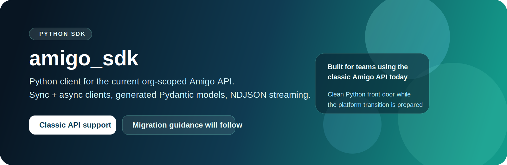
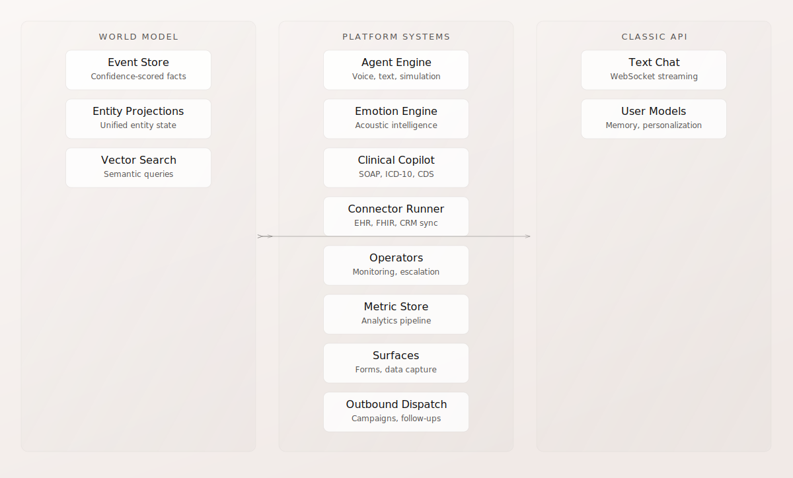

<p align="center">
  
</p>

<h1 align="center">amigo_sdk</h1>

<p align="center">Official Python SDK for the classic Amigo API.</p>

<p align="center">
  <a href="https://docs.amigo.ai">Product Docs</a>
  ·
  <a href="https://docs.amigo.ai/developer-guide">Developer Guide</a>
  ·
  <a href="https://amigo-ai.github.io/amigo-python-sdk/">API Reference</a>
  ·
  <a href="https://github.com/amigo-ai/amigo-python-sdk/tree/main/examples">Examples</a>
  ·
  <a href="https://github.com/amigo-ai/amigo-python-sdk/blob/main/CHANGELOG.md">Changelog</a>
</p>

<p align="center">
  <a href="https://github.com/amigo-ai/amigo-python-sdk/actions/workflows/test.yml"></a>
  <a href="https://codecov.io/gh/amigo-ai/amigo-python-sdk"></a>
  <a href="https://opensource.org/licenses/MIT"></a>
</p>

Synchronous and asynchronous Python clients for the classic org-scoped Amigo API, with generated Pydantic models, typed errors, and NDJSON conversation streaming.

## Classic API Context

`amigo_sdk` is the Python client boundary for teams that integrate with the classic org-scoped Amigo API today. It keeps sync and async application code close to the live contract while a platform-native migration path is prepared.



## Product Status

`amigo_sdk` remains the supported Python client for the classic Amigo API.

The Platform API is the long-term direction for new workspace-scoped capabilities, but classic Python customers are not facing an abrupt end-of-life event. As equivalent platform surfaces become available, Amigo will publish a migration path and upgrade guidance before asking customers to move.

## Choose The Right Surface

| If you need | Start here |
| --- | --- |
| The current org-scoped Amigo API from Python | `amigo_sdk` |
| New workspace-scoped Platform API capabilities | [Platform API docs](https://docs.amigo.ai/api-reference) today. Python migration guidance will follow as platform-native coverage expands |

## API Context

This SDK is the Python client boundary for the classic Amigo API at `https://api.amigo.ai`. It covers the current org-scoped resource model used by existing Amigo deployments, including conversations, services, organizations, users, agents, context graphs, and streaming events.

## Documentation

| Need | Best entry point |
| --- | --- |
| Product overview and deployment context | [docs.amigo.ai](https://docs.amigo.ai/) |
| Integration guidance and developer docs | [Developer Guide](https://docs.amigo.ai/developer-guide) |
| Generated API reference | [amigo-ai.github.io/amigo-python-sdk](https://amigo-ai.github.io/amigo-python-sdk/) |
| Runnable examples | [examples/](https://github.com/amigo-ai/amigo-python-sdk/tree/main/examples) |
| Release history | [CHANGELOG.md](https://github.com/amigo-ai/amigo-python-sdk/blob/main/CHANGELOG.md) |

## Installation

Python `3.11+` is required.

```bash
pip install amigo_sdk
```

## Quick Start

### Sync Client

```python
from amigo_sdk import AmigoClient
from amigo_sdk.models import GetConversationsParametersQuery

with AmigoClient(
    api_key="your-api-key",
    api_key_id="your-api-key-id",
    user_id="user-id",
    organization_id="your-organization-id",
) as client:
    conversations = client.conversations.get_conversations(
        GetConversationsParametersQuery(limit=10, sort_by=["-created_at"])
    )
    print(conversations.conversations[0].id if conversations.conversations else None)
```

### Async Client

```python
import asyncio

from amigo_sdk import AsyncAmigoClient
from amigo_sdk.models import GetConversationsParametersQuery


async def main() -> None:
    async with AsyncAmigoClient(
        api_key="your-api-key",
        api_key_id="your-api-key-id",
        user_id="user-id",
        organization_id="your-organization-id",
    ) as client:
        conversations = await client.conversations.get_conversations(
            GetConversationsParametersQuery(limit=10, sort_by=["-created_at"])
        )
        print(len(conversations.conversations))


asyncio.run(main())
```

## Configuration

| Option | Type | Required | Description |
| --- | --- | --- | --- |
| `api_key` | `str` | Yes | API key from the Amigo dashboard |
| `api_key_id` | `str` | Yes | API key ID paired with `api_key` |
| `user_id` | `str` | Yes | User ID on whose behalf the request is made |
| `organization_id` | `str` | Yes | Organization ID for the classic API |
| `base_url` | `str` | No | Override the API base URL. Defaults to `https://api.amigo.ai` |

Environment variables are also supported:

```bash
export AMIGO_API_KEY="your-api-key"
export AMIGO_API_KEY_ID="your-api-key-id"
export AMIGO_USER_ID="user-id"
export AMIGO_ORGANIZATION_ID="your-organization-id"
export AMIGO_BASE_URL="https://api.amigo.ai"
```

## Generated Models

The SDK ships with generated Pydantic models and exposes them from `amigo_sdk.models`:

```python
from amigo_sdk.models import (
    ConversationCreateConversationRequest,
    GetConversationsParametersQuery,
)
```

## Error Handling

```python
from amigo_sdk import AmigoClient
from amigo_sdk.errors import AuthenticationError, NotFoundError, RateLimitError

try:
    with AmigoClient() as client:
        organization = client.organizations.get()
        print(organization.id)
except AuthenticationError as error:
    print("Authentication failed:", error)
except NotFoundError as error:
    print("Resource not found:", error)
except RateLimitError as error:
    print("Rate limited:", error)
```

## Support

Use the [issue tracker](https://github.com/amigo-ai/amigo-python-sdk/issues) for bugs and feature requests. For responsible disclosure, see [SECURITY.md](https://github.com/amigo-ai/amigo-python-sdk/blob/main/SECURITY.md).
